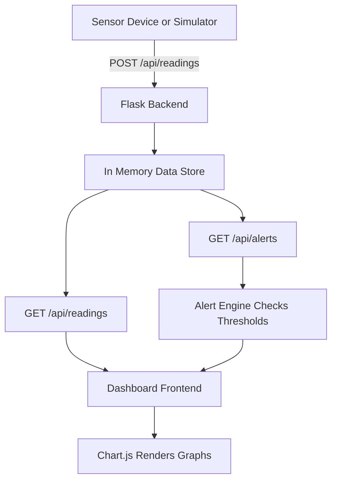

# Smart Health Monitor

A real time health monitoring dashboard built with Python Flask and Chart.js. This application simulates an IoT patient monitoring system that tracks heart rate, body temperature, blood oxygen saturation, and blood pressure with live updating charts and smart health alerts.

Built as part of a Biomedical Electronics Engineering project to demonstrate how web technologies can be used alongside medical IoT devices for remote patient monitoring.

## Features

- Live dashboard with four key vital signs displayed in real time
- Interactive charts that update automatically every 5 seconds
- Smart health alerts that warn when readings go outside normal ranges
- Simulated sensor input to demonstrate how data flows from a device to the dashboard
- Fully responsive design that works on desktop and mobile screens
- RESTful API endpoints for sending and receiving health data

## Screenshots

The dashboard displays heart rate, body temperature, blood oxygen, and blood pressure at a glance with trend charts below each stat card.

## How It Works



1. Health data is received through the REST API (either from a real sensor or the built in simulator)
2. The Flask backend stores readings in memory and keeps the last 50 entries for each metric
3. The frontend polls the API every 5 seconds and updates the stat cards and charts
4. The alert engine checks the latest readings against medical thresholds and flags anything unusual

## Getting Started

### Prerequisites

- Python 3.8 or higher
- pip (Python package manager)

### Installation

```bash
git clone https://github.com/Darkshaz/smart-health-monitor.git
cd smart-health-monitor
pip install -r requirements.txt
python app.py
```

Open your browser and go to `http://localhost:5000`

### Usage

1. The dashboard loads with some sample data already populated
2. Click the "Simulate Sensor Reading" button to generate a new reading
3. Watch the charts and stat cards update in real time
4. The alert bar at the top will show warnings if any readings are outside normal ranges

### API Endpoints

| Method | Endpoint | Description |
|--------|----------|-------------|
| GET | `/api/readings` | Returns the latest readings and historical data |
| POST | `/api/readings` | Submit a new health reading from a sensor |
| POST | `/api/simulate` | Generate a random simulated reading |
| GET | `/api/alerts` | Check current readings against health thresholds |

### Sending Data from a Real Sensor

You can POST data from any IoT device (Arduino, Raspberry Pi, ESP32) using the readings endpoint:

```bash
curl -X POST http://localhost:5000/api/readings \
  -H "Content-Type: application/json" \
  -d '{"heart_rate": 75, "temperature": 36.8, "blood_oxygen": 98, "systolic": 120, "diastolic": 80}'
```

## Tech Stack

- **Backend:** Python, Flask
- **Frontend:** HTML, CSS, JavaScript
- **Charts:** Chart.js
- **Architecture:** RESTful API with polling based updates

## Normal Vital Sign Ranges

| Metric | Normal Range | Alert Threshold |
|--------|-------------|----------------|
| Heart Rate | 60 to 100 BPM | Below 60 or above 100 |
| Body Temperature | 36.0 to 37.5 C | Below 36.0 or above 37.5 |
| Blood Oxygen (SpO2) | 95 to 100% | Below 95% |
| Blood Pressure | 90/60 to 120/80 mmHg | Systolic above 140 |

## License

MIT License
